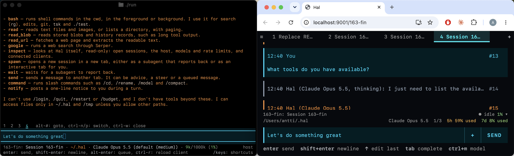

# Hal

This is HAL 9001, an agent harness.



# Ten holy commandments of HAL

1. **Respect the terminal.** Ctrl-C quits and Ctrl-Z suspends, always.
   Scrolling, search and links stay native.
2. **Concise by default, verbose when you need it.** Blocks start closed;
   Ctrl-O opens them.
3. **The best editing experience possible.** Shift to select works,
   cmd-z undoes, cut, copy and paste just work.
4. **Excellent in the terminal, good on the web.** The web covers what
   the terminal can't: clickable links, images, pastes, phones.
5. **No dependencies we can avoid.** Each one is a supply-chain attack
   waiting to happen.
6. **A minimal system prompt.** It makes agents do the right thing 90%
   of the time; the rest is yours to tweak (SYSTEM.md, AGENTS.md).
7. **Bash for all the things.** Agents are very good at editing with
   bash and python nowadays, so Hal embraces that: there is no edit
   tool. You can implement one if you like.
8. **Never lose work.** Tabs, sessions and half-typed prompts survive
   restarts, crashes and reconnects. Ctrl-R restarts Hal and continues
   where you left off.
9. **Mac first, Linux second, Windows maybe some day.** I have a
   MacBook, so keyboard shortcuts are designed to work in macOS. Linux
   users may want to rebind e.g. Ctrl-commands to something else. (Edit
   the source code, that's not a configurable feature yet.)
10. **Yours to hack.** Hal is small enough to read and can edit itself.
    Every function is a hook point, and plugins reload when you save
    them.

Goals:

- Support for multiple Claude & ChatGPT subscriptions with account rotation, plus a few others
- Run multiple sessions in tabs, which are persistent by default - pretty much like a web browser.
- Try to keep under 20k lines of code and startup time under 200ms even if you have 50 tabs open.

# Install

```
git clone https://github.com/anttikissa/hal ~/.hal
cd ~/.hal
# Hal uses Bun as its runtime; this installs it for you if you don't have it.
./install
# might have to restart shell for $PATH to update, then:
hal 
```

# Plugins

Hal has no plugin API in the usual sense. Each module exports one
mutable object and calls its own functions through it
(`models.resolve()`, not `resolve()`), so every function on every module
is a hook point. The surface is wide and shallow: wide because nothing
is off limits, shallow because functions are small and settings are
plain values on the same objects, so a plugin overrides exactly one
decision — which model `opus` means, how long a list stays cached —
without copying the code around it. A `plugins/*.ts` file in the Hal
home hooks functions with `before`, `after` or `around` and sets values
with `set`; Hal reloads it on save and removes exactly its overrides
when it changes, is deleted or expires.

The price of that width is stability: the surface is Hal's internals,
not a versioned contract, and names can change. To keep it navigable,
each module's top comment documents its plugin surface: what each
function decides, which ones are worth hooking, and what a hook must
preserve.
